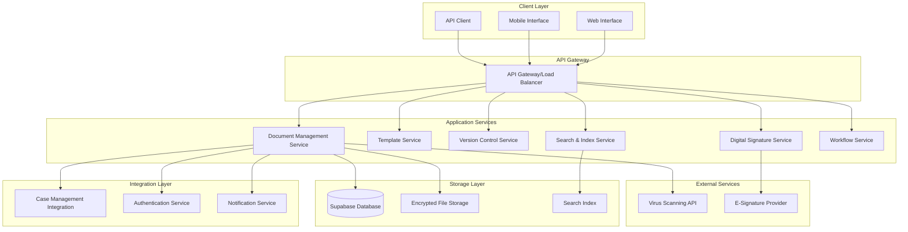

# Design Document: Document Management System

## Overview

The Document Management System (DMS) for JuristDZ is designed as a comprehensive document handling solution that integrates seamlessly with the existing case management platform. The system follows a microservices architecture pattern, leveraging Supabase for data persistence and implementing robust security measures to meet legal industry requirements.

The design emphasizes security, compliance, and user experience while maintaining compatibility with the existing multi-tenant architecture and role-based access control system.

## Architecture

### High-Level Architecture



### Service Architecture

The system is built using a modular service architecture where each service handles specific domain responsibilities:

- **Document Management Service**: Core document operations (upload, download, metadata management)
- **Template Service**: Template creation, management, and document generation
- **Version Control Service**: Document versioning, comparison, and history tracking
- **Digital Signature Service**: Electronic signature workflows and compliance
- **Search & Index Service**: Full-text search and document indexing
- **Workflow Service**: Document approval and review workflows

## Components and Interfaces

### Document Management Service

**Primary Responsibilities:**
- Document upload and validation
- File storage coordination with encryption
- Metadata management and organization
- Access control enforcement
- Integration with existing case management

**Key Interfaces:**
```typescript
interface DocumentService {
  uploadDocument(file: File, caseId: string, metadata: DocumentMetadata): Promise<Document>
  getDocument(documentId: string): Promise<Document>
  updateDocument(documentId: string, updates: Partial<Document>): Promise<Document>
  deleteDocument(documentId: string): Promise<void>
  listDocuments(caseId: string, filters?: DocumentFilters): Promise<Document[]>
  moveDocument(documentId: string, targetFolderId: string): Promise<void>
}

interface FolderService {
  createFolder(caseId: string, name: string, parentId?: string): Promise<Folder>
  getFolderContents(folderId: string): Promise<FolderContents>
  moveFolder(folderId: string, targetParentId: string): Promise<void>
  deleteFolder(folderId: string): Promise<void>
}
```

### Template Service

**Primary Responsibilities:**
- Template storage and management
- Role-based template access
- Document generation from templates
- Multi-language template support

**Key Interfaces:**
```typescript
interface TemplateService {
  getTemplatesByRole(userRole: UserRole, language: Language): Promise<Template[]>
  createTemplate(template: TemplateDefinition): Promise<Template>
  generateDocument(templateId: string, variables: TemplateVariables): Promise<GeneratedDocument>
  updateTemplate(templateId: string, updates: Partial<Template>): Promise<Template>
}

interface TemplateEngine {
  processTemplate(template: Template, variables: TemplateVariables): Promise<ProcessedDocument>
  validateVariables(template: Template, variables: TemplateVariables): ValidationResult
}
```

### Version Control Service

**Primary Responsibilities:**
- Automatic version creation on document changes
- Version comparison and diff generation
- Version restoration capabilities
- Version history maintenance

**Key Interfaces:**
```typescript
interface VersionControlService {
  createVersion(documentId: string, content: Buffer, userId: string): Promise<DocumentVersion>
  getVersionHistory(documentId: string): Promise<DocumentVersion[]>
  compareVersions(versionId1: string, versionId2: string): Promise<VersionComparison>
  restoreVersion(documentId: string, versionId: string): Promise<Document>
  getVersionContent(versionId: string): Promise<Buffer>
}
```

### Digital Signature Service

**Primary Responsibilities:**
- Electronic signature workflow management
- Signature validation and verification
- Compliance with Algerian e-signature laws
- Audit trail maintenance

**Key Interfaces:**
```typescript
interface SignatureService {
  createSignatureWorkflow(documentId: string, signers: SignerInfo[]): Promise<SignatureWorkflow>
  signDocument(workflowId: string, signerId: string, signature: DigitalSignature): Promise<SignedDocument>
  validateSignature(documentId: string, signatureId: string): Promise<SignatureValidation>
  getSignatureStatus(workflowId: string): Promise<WorkflowStatus>
}
```

### Search & Index Service

**Primary Responsibilities:**
- Full-text document indexing
- Multi-language search support
- Metadata and tag-based search
- Search result ranking and filtering

**Key Interfaces:**
```typescript
interface SearchService {
  indexDocument(document: Document, content: string): Promise<void>
  searchDocuments(query: SearchQuery, filters: SearchFilters): Promise<SearchResults>
  suggestTags(partialTag: string): Promise<string[]>
  updateIndex(documentId: string, content: string): Promise<void>
}
```

## Data Models

### Core Document Model

```typescript
interface Document {
  id: string
  caseId: string
  name: string
  originalName: string
  mimeType: string
  size: number
  checksum: string
  encryptionKey: string
  storagePath: string
  folderId?: string
  tags: string[]
  metadata: DocumentMetadata
  createdAt: Date
  updatedAt: Date
  createdBy: string
  currentVersionId: string
  isDeleted: boolean
  deletedAt?: Date
}

interface DocumentMetadata {
  description?: string
  category: DocumentCategory
  confidentialityLevel: ConfidentialityLevel
  retentionPeriod?: number
  customFields: Record<string, any>
}

enum DocumentCategory {
  CONTRACT = 'contract',
  PLEADING = 'pleading',
  EVIDENCE = 'evidence',
  CORRESPONDENCE = 'correspondence',
  TEMPLATE = 'template',
  OTHER = 'other'
}

enum ConfidentialityLevel {
  PUBLIC = 'public',
  INTERNAL = 'internal',
  CONFIDENTIAL = 'confidential',
  RESTRICTED = 'restricted'
}
```

### Folder Structure Model

```typescript
interface Folder {
  id: string
  caseId: string
  name: string
  parentId?: string
  path: string
  level: number
  createdAt: Date
  createdBy: string
  isDeleted: boolean
}

interface FolderContents {
  folders: Folder[]
  documents: Document[]
  totalCount: number
}
```

### Version Control Model

```typescript
interface DocumentVersion {
  id: string
  documentId: string
  versionNumber: number
  size: number
  checksum: string
  storagePath: string
  createdAt: Date
  createdBy: string
  changeDescription?: string
  isCurrent: boolean
}

interface VersionComparison {
  oldVersion: DocumentVersion
  newVersion: DocumentVersion
  differences: VersionDifference[]
  similarityScore: number
}

interface VersionDifference {
  type: 'addition' | 'deletion' | 'modification'
  location: DifferenceLocation
  oldContent?: string
  newContent?: string
}
```

### Template Model

```typescript
interface Template {
  id: string
  name: string
  description: string
  category: TemplateCategory
  language: Language
  applicableRoles: UserRole[]
  content: string
  variables: TemplateVariable[]
  createdAt: Date
  createdBy: string
  isActive: boolean
}

interface TemplateVariable {
  name: string
  type: VariableType
  label: string
  required: boolean
  defaultValue?: any
  validation?: ValidationRule[]
}

enum TemplateCategory {
  CONTRACT = 'contract',
  MOTION = 'motion',
  BRIEF = 'brief',
  NOTICE = 'notice',
  AGREEMENT = 'agreement'
}

enum VariableType {
  TEXT = 'text',
  DATE = 'date',
  NUMBER = 'number',
  BOOLEAN = 'boolean',
  LIST = 'list'
}
```

### Digital Signature Model

```typescript
interface SignatureWorkflow {
  id: string
  documentId: string
  status: WorkflowStatus
  signers: WorkflowSigner[]
  createdAt: Date
  createdBy: string
  completedAt?: Date
  expiresAt: Date
}

interface WorkflowSigner {
  id: string
  userId?: string
  email: string
  name: string
  role: string
  order: number
  status: SignerStatus
  signedAt?: Date
  signature?: DigitalSignature
}

interface DigitalSignature {
  id: string
  signerId: string
  signatureData: string
  certificate: string
  timestamp: Date
  ipAddress: string
  location?: string
}

enum WorkflowStatus {
  PENDING = 'pending',
  IN_PROGRESS = 'in_progress',
  COMPLETED = 'completed',
  CANCELLED = 'cancelled',
  EXPIRED = 'expired'
}

enum SignerStatus {
  PENDING = 'pending',
  SIGNED = 'signed',
  DECLINED = 'declined'
}
```

### Access Control Model

```typescript
interface DocumentPermission {
  id: string
  documentId: string
  userId?: string
  roleId?: string
  permission: Permission
  grantedBy: string
  grantedAt: Date
  expiresAt?: Date
}

enum Permission {
  VIEW = 'view',
  EDIT = 'edit',
  DELETE = 'delete',
  SHARE = 'share',
  SIGN = 'sign'
}

interface ShareLink {
  id: string
  documentId: string
  token: string
  permissions: Permission[]
  expiresAt: Date
  createdBy: string
  accessCount: number
  maxAccess?: number
}
```

## Correctness Properties

*A property is a characteristic or behavior that should hold true across all valid executions of a system—essentially, a formal statement about what the system should do. Properties serve as the bridge between human-readable specifications and machine-verifiable correctness guarantees.*

Based on the prework analysis of acceptance criteria, the following properties ensure system correctness:

### File Upload and Storage Properties

**Property 1: File Format Validation**
*For any* uploaded file, the system should accept the file if and only if it has a valid format (PDF, DOC, DOCX, JPG, PNG, TXT)
**Validates: Requirements 1.1**

**Property 2: File Size Enforcement**
*For any* file upload attempt, files exceeding 50MB should be rejected with an appropriate error message, while files under 50MB should be accepted
**Validates: Requirements 1.2**

**Property 3: Upload Processing Pipeline**
*For any* successfully uploaded file, the system should encrypt it with AES-256, scan for viruses, generate a unique identifier, and store metadata
**Validates: Requirements 1.3, 1.4, 1.6**

**Property 4: Virus Detection Handling**
*For any* file that contains malware, the system should quarantine the file and notify the user rather than storing it normally
**Validates: Requirements 1.5**

### Document Organization Properties

**Property 5: Case Association**
*For any* document upload, the document should be successfully associated with any valid existing case
**Validates: Requirements 2.1**

**Property 6: Folder Hierarchy Limits**
*For any* folder creation attempt, folders should be created successfully up to 5 levels deep, and attempts to create deeper nesting should be rejected
**Validates: Requirements 2.2**

**Property 7: Tag Indexing**
*For any* document with assigned tags, those tags should be stored and become searchable immediately
**Validates: Requirements 2.3**

**Property 8: Comprehensive Search**
*For any* search query, results should include documents matching the query in filename, content, tags, or metadata
**Validates: Requirements 2.4**

**Property 9: Multi-Criteria Filtering**
*For any* filter combination (date range, file type, case, tags), the system should return only documents matching all specified criteria
**Validates: Requirements 2.5**

**Property 10: Hierarchy Consistency**
*For any* folder operation (create, move, delete), the folder hierarchy and document associations should remain consistent and valid
**Validates: Requirements 2.6**

### Template Engine Properties

**Property 11: Role-Based Template Access**
*For any* user accessing templates, only templates appropriate for their role should be visible and accessible
**Validates: Requirements 3.1**

**Property 12: Template Variable Display**
*For any* selected template, all customizable variables and fields should be displayed to the user
**Validates: Requirements 3.2**

**Property 13: Document Generation**
*For any* template with filled variables, a complete document with proper formatting should be generated
**Validates: Requirements 3.3**

**Property 14: Template Persistence Round-Trip**
*For any* custom template, saving and then loading the template should produce an equivalent template with all variables intact
**Validates: Requirements 3.4**

**Property 15: Multi-Language Template Support**
*For any* template operation, the system should handle both French and Arabic templates correctly with proper text direction and formatting
**Validates: Requirements 3.5, 3.6**

### Version Control Properties

**Property 16: Automatic Versioning**
*For any* document modification, a new version should be created while preserving all previous versions
**Validates: Requirements 4.1**

**Property 17: Version Comparison Accuracy**
*For any* two document versions, the comparison should accurately identify and highlight all differences between them
**Validates: Requirements 4.2**

**Property 18: Version Restoration Integrity**
*For any* version restoration, the selected version should become current while preserving the complete version history
**Validates: Requirements 4.3**

**Property 19: Version Metadata Completeness**
*For any* document version, it should have complete metadata including timestamp, user information, and modification details
**Validates: Requirements 4.4, 4.5**

**Property 20: Version Data Integrity**
*For any* version control operation, no version data should be lost or corrupted during the process
**Validates: Requirements 4.6**

### Collaboration and Sharing Properties

**Property 21: Granular Permission Assignment**
*For any* document sharing operation, specific permissions (view, edit, comment) should be assignable to each recipient independently
**Validates: Requirements 5.1**

**Property 22: Comment Metadata Preservation**
*For any* comment added to a document, it should be stored with complete metadata including timestamp and author information
**Validates: Requirements 5.2**

**Property 23: Concurrent Editing Safety**
*For any* simultaneous editing scenario, the system should handle concurrent modifications without data conflicts or corruption
**Validates: Requirements 5.3**

**Property 24: Access Notification**
*For any* document access grant, the recipient should be notified through the platform notification system
**Validates: Requirements 5.4**

**Property 25: Permission Inheritance Consistency**
*For any* document, its access permissions should be consistent with the associated case's role-based permissions
**Validates: Requirements 5.5**

**Property 26: Secure External Sharing**
*For any* external sharing request, the system should generate secure, time-limited access links with appropriate restrictions
**Validates: Requirements 5.6**

### Digital Signature Properties

**Property 27: Signature Workflow Creation**
*For any* document signing initiation, a proper signature workflow should be created with all designated signers and their roles
**Validates: Requirements 6.1**

**Property 28: Cryptographic Signature Security**
*For any* applied digital signature, it should be cryptographically secure and verifiable
**Validates: Requirements 6.2**

**Property 29: Signature Validation Artifacts**
*For any* signed document, it should have a tamper-evident seal and valid certificate proving signature authenticity
**Validates: Requirements 6.3**

**Property 30: Signature Workflow Completion**
*For any* completed signature workflow, all parties should be notified and the document status should be updated appropriately
**Validates: Requirements 6.5**

**Property 31: Signature Audit Trail Completeness**
*For any* signature activity, it should be completely logged in the audit trail with all relevant details
**Validates: Requirements 6.6**

### Security and Compliance Properties

**Property 32: Encryption at Rest**
*For any* stored document, it should be encrypted using AES-256 encryption
**Validates: Requirements 7.1**

**Property 33: Transmission Security**
*For any* document transmission, it should use TLS 1.3 encryption
**Validates: Requirements 7.2**

**Property 34: Comprehensive Activity Logging**
*For any* document operation, it should be logged with complete details including user, timestamp, and action information
**Validates: Requirements 7.3**

**Property 35: Attorney-Client Privilege Enforcement**
*For any* document access attempt, attorney-client privilege restrictions should be enforced based on case assignments
**Validates: Requirements 7.4**

**Property 36: Enhanced Authentication for Sensitive Content**
*For any* access to sensitive documents, additional authentication should be required beyond standard login
**Validates: Requirements 7.5**

**Property 37: Compliance Audit Reports**
*For any* audit report request, the system should generate reports containing all required compliance verification information
**Validates: Requirements 7.6**

**Property 38: Automatic Data Purging**
*For any* deleted document, it should be automatically purged after the legally required retention period expires
**Validates: Requirements 7.7**

### System Integration Properties

**Property 39: Case-Document Integration Display**
*For any* case view, all associated documents should be displayed within the case interface
**Validates: Requirements 8.1**

**Property 40: Permission System Integration**
*For any* user, their document management permissions should inherit from and be consistent with their case management system permissions
**Validates: Requirements 8.2**

**Property 41: Automatic Workspace Creation**
*For any* new case creation, a corresponding document workspace should be automatically created
**Validates: Requirements 8.3**

**Property 42: Multi-Language Platform Consistency**
*For any* user interface interaction, the system should support both French and Arabic interfaces matching the existing platform standards
**Validates: Requirements 8.4**

**Property 43: Mobile Responsiveness**
*For any* mobile device access, the system should provide responsive document viewing and basic operations
**Validates: Requirements 8.5**

**Property 44: Database Architecture Integration**
*For any* data operation, the system should work correctly with the existing Supabase database architecture
**Validates: Requirements 8.6**

**Property 45: Bulk Export Functionality**
*For any* export request, the system should provide bulk export and backup capabilities for multiple documents
**Validates: Requirements 8.7**

### Content Processing Properties

**Property 46: Document Text Extraction**
*For any* uploaded PDF or Word document, the system should extract and index the text content for searching
**Validates: Requirements 9.1, 9.2**

**Property 47: Legal Content Analysis**
*For any* processed document, the system should identify and extract key legal terms and dates from the content
**Validates: Requirements 9.3**

**Property 48: Searchable Metadata Generation**
*For any* document processing, searchable metadata should be generated from the document content
**Validates: Requirements 9.4**

**Property 49: Arabic Text Processing**
*For any* Arabic document, the system should handle right-to-left text correctly during processing and display
**Validates: Requirements 9.5**

**Property 50: Format Preservation During Indexing**
*For any* document indexing operation, the original document formatting should be maintained while enabling text search
**Validates: Requirements 9.6**

### Workflow Management Properties

**Property 51: Workflow Definition Flexibility**
*For any* workflow creation, the system should allow defining custom approval steps and assigning specific reviewers
**Validates: Requirements 10.1**

**Property 52: Workflow Initiation and Tracking**
*For any* document entering a workflow, assigned reviewers should be notified and progress should be tracked
**Validates: Requirements 10.2**

**Property 53: Workflow State Transitions**
*For any* reviewer action (approve/reject), the workflow should advance appropriately or return for revisions
**Validates: Requirements 10.3**

**Property 54: Workflow Document Protection**
*For any* document in an active workflow, unauthorized modifications should be prevented
**Validates: Requirements 10.4**

**Property 55: Workflow Completion Processing**
*For any* completed workflow, the document status should be updated and all stakeholders should be notified
**Validates: Requirements 10.5**

**Property 56: Workflow Audit Trail Maintenance**
*For any* workflow activity, complete history and decision audit trails should be maintained
**Validates: Requirements 10.6**

## Error Handling

The system implements comprehensive error handling across all components:

### Upload Error Handling
- **File Format Errors**: Clear messaging for unsupported file types with list of supported formats
- **File Size Errors**: Specific error messages indicating size limit and current file size
- **Virus Detection**: Quarantine procedures with user notification and admin alerts
- **Storage Failures**: Retry mechanisms with exponential backoff and fallback storage options

### Access Control Errors
- **Permission Denied**: Clear indication of required permissions and how to request access
- **Authentication Failures**: Secure error messages that don't reveal system information
- **Session Expiry**: Automatic re-authentication prompts with state preservation

### Integration Errors
- **Case Management Sync**: Retry mechanisms for temporary connectivity issues
- **Database Failures**: Transaction rollback and data consistency preservation
- **External Service Failures**: Graceful degradation with offline capabilities where possible

### Workflow Errors
- **Invalid State Transitions**: Prevention of illegal workflow state changes with clear error messages
- **Reviewer Unavailability**: Automatic reassignment and escalation procedures
- **Deadline Violations**: Automated notifications and escalation to supervisors

## Testing Strategy

The Document Management System employs a comprehensive dual testing approach combining unit tests for specific scenarios and property-based tests for universal correctness validation.

### Property-Based Testing Configuration

**Testing Framework**: The system uses **fast-check** for TypeScript/JavaScript property-based testing, configured with:
- Minimum 100 iterations per property test to ensure comprehensive input coverage
- Custom generators for domain-specific data types (documents, users, cases, workflows)
- Shrinking capabilities to find minimal failing examples when properties fail

**Property Test Implementation**: Each correctness property from the design document must be implemented as a property-based test with the following tag format:
```typescript
// Feature: document-management-system, Property 1: File Format Validation
```

### Unit Testing Strategy

Unit tests complement property tests by focusing on:
- **Specific Examples**: Concrete scenarios that demonstrate correct behavior
- **Edge Cases**: Boundary conditions and corner cases not easily covered by property tests
- **Integration Points**: Interactions between services and external dependencies
- **Error Conditions**: Specific error scenarios and recovery mechanisms

**Key Unit Test Areas**:
- File upload validation with specific file types and sizes
- Template generation with known variable sets
- Version comparison with specific document changes
- Signature workflow state transitions
- Multi-language content processing examples

### Integration Testing

**Service Integration**: Tests verify correct interaction between:
- Document Management Service ↔ File Storage Service
- Template Engine ↔ Document Management Service  
- Version Control Service ↔ Document Management Service
- Signature Service ↔ Workflow Service
- Search Service ↔ Content Processing Pipeline

**External Integration**: Tests validate integration with:
- Supabase database operations
- Case Management System APIs
- Virus scanning services
- Electronic signature providers
- Notification systems

### Performance and Security Testing

**Performance Requirements**:
- Document upload processing under 5 seconds for files up to 50MB
- Search response times under 2 seconds for queries across 10,000+ documents
- Concurrent user support for up to 100 simultaneous document operations

**Security Testing**:
- Encryption verification for all stored documents
- Access control enforcement across all permission levels
- Audit trail completeness and tamper resistance
- Input validation and sanitization for all user inputs

### Test Data Management

**Synthetic Data Generation**: Property tests use generated data including:
- Random document content in French and Arabic
- Varied file formats and sizes
- Complex folder hierarchies and permission structures
- Multi-step workflow scenarios

**Test Environment**: Isolated test environment with:
- Separate Supabase test database
- Mock external services for virus scanning and e-signatures
- Configurable test data sets for different scenarios
