# Document de Conception - Plateforme Juridique Multi-Rôles JuristDZ

## Vue d'Ensemble

La transformation de JuristDZ en plateforme juridique multi-rôles nécessite une architecture modulaire et sécurisée supportant sept types d'utilisateurs distincts avec des besoins fonctionnels spécialisés. La plateforme intègrera les spécificités du système juridique algérien tout en offrant une expérience utilisateur adaptée à chaque métier juridique.

### Objectifs Architecturaux

- **Multi-tenancy sécurisée** : Isolation complète des données entre utilisateurs et organisations
- **Contrôle d'accès granulaire** : Permissions spécialisées par rôle professionnel
- **Extensibilité** : Architecture modulaire permettant l'ajout de nouveaux rôles et fonctionnalités
- **Conformité juridique** : Respect du secret professionnel et des obligations légales algériennes
- **Performance** : Support de milliers d'utilisateurs simultanés avec temps de réponse optimaux

## Architecture

### Architecture Globale

```mermaid
graph TB
    subgraph "Couche Présentation"
        UI_Avocat[Interface Avocat]
        UI_Notaire[Interface Notaire]
        UI_Huissier[Interface Huissier]
        UI_Magistrat[Interface Magistrat]
        UI_Etudiant[Interface Étudiant]
        UI_Juriste[Interface Juriste Entreprise]
        UI_Admin[Interface Admin]
    end
    
    subgraph "Couche API"
        API_Gateway[Passerelle API]
        Auth_Service[Service Authentification]
        RBAC_Service[Service RBAC]
    end
    
    subgraph "Couche Métier"
        Document_Service[Service Documents]
        Search_Service[Service Recherche]
        Billing_Service[Service Facturation]
        Workflow_Service[Service Workflows]
        AI_Service[Service IA Juridique]
        Notification_Service[Service Notifications]
    end
    
    subgraph "Couche Données"
        User_DB[(Base Utilisateurs)]
        Document_DB[(Base Documents)]
        Legal_DB[(Base Juridique)]
        Audit_DB[(Base Audit)]
        File_Storage[Stockage Fichiers]
    end
    
    UI_Avocat --> API_Gateway
    UI_Notaire --> API_Gateway
    UI_Huissier --> API_Gateway
    UI_Magistrat --> API_Gateway
    UI_Etudiant --> API_Gateway
    UI_Juriste --> API_Gateway
    UI_Admin --> API_Gateway
    
    API_Gateway --> Auth_Service
    API_Gateway --> RBAC_Service
    API_Gateway --> Document_Service
    API_Gateway --> Search_Service
    API_Gateway --> Billing_Service
    API_Gateway --> Workflow_Service
    API_Gateway --> AI_Service
    API_Gateway --> Notification_Service
    
    Document_Service --> Document_DB
    Search_Service --> Legal_DB
    Billing_Service --> User_DB
    Auth_Service --> User_DB
    RBAC_Service --> User_DB
    AI_Service --> Legal_DB
    Document_Service --> File_Storage
    Notification_Service --> Audit_DB
```



### Modèle Multi-Tenant

La plateforme utilise un modèle multi-tenant hybride :

- **Isolation au niveau application** : Séparation logique des données par tenant_id
- **Isolation physique pour données sensibles** : Chiffrement spécifique par organisation
- **Ressources partagées** : Base juridique commune (codes, jurisprudence, JORA)
- **Configuration par tenant** : Paramètres spécifiques par barreau/organisation

## Composants et Interfaces

### Service d'Authentification et Autorisation

**Responsabilités** :
- Authentification multi-facteur obligatoire pour professionnels
- Gestion des sessions sécurisées avec expiration adaptative
- Intégration avec les annuaires professionnels (barreaux, chambres notariales)
- Support de l'authentification fédérée pour les institutions

**Interface** :
```typescript
interface AuthenticationService {
  authenticate(credentials: UserCredentials): Promise<AuthResult>
  validateSession(token: string): Promise<SessionInfo>
  refreshToken(refreshToken: string): Promise<TokenPair>
  logout(sessionId: string): Promise<void>
  enableMFA(userId: string, method: MFAMethod): Promise<MFASetup>
}

interface AuthResult {
  success: boolean
  user?: UserProfile
  tokens?: TokenPair
  mfaRequired?: boolean
  error?: string
}
```

### Service RBAC (Role-Based Access Control)

**Modèle de Permissions** :
- **Rôles globaux** : Avocat, Notaire, Huissier, Magistrat, Étudiant, Juriste_Entreprise, Admin
- **Permissions granulaires** : Par fonctionnalité et type de document
- **Contexte organisationnel** : Permissions limitées au barreau/organisation d'appartenance
- **Délégation temporaire** : Permissions temporaires pour collaborations

**Interface** :
```typescript
interface RBACService {
  checkPermission(userId: string, resource: string, action: string): Promise<boolean>
  getUserRoles(userId: string): Promise<Role[]>
  assignRole(userId: string, roleId: string, context?: OrganizationContext): Promise<void>
  createCustomRole(organizationId: string, roleDefinition: RoleDefinition): Promise<Role>
  getEffectivePermissions(userId: string, context: AccessContext): Promise<Permission[]>
}

interface Permission {
  resource: string
  actions: string[]
  conditions?: AccessCondition[]
  scope: PermissionScope
}
```

### Service de Gestion Documentaire

**Fonctionnalités** :
- Stockage sécurisé avec chiffrement bout-en-bout
- Versioning automatique des documents
- Signature électronique intégrée
- Templates spécialisés par rôle et domaine juridique
- Workflow de validation et approbation

**Interface** :
```typescript
interface DocumentService {
  createDocument(template: DocumentTemplate, data: DocumentData): Promise<Document>
  saveDocument(document: Document): Promise<DocumentVersion>
  getDocument(documentId: string, userId: string): Promise<Document>
  searchDocuments(criteria: SearchCriteria, userId: string): Promise<Document[]>
  generateFromTemplate(templateId: string, variables: TemplateVariables): Promise<Document>
  signDocument(documentId: string, signature: ElectronicSignature): Promise<SignedDocument>
}

interface DocumentTemplate {
  id: string
  name: string
  category: DocumentCategory
  roleRestrictions: UserRole[]
  template: string
  variables: TemplateVariable[]
  legalReferences: LegalReference[]
}
```

### Service de Recherche Juridique

**Capacités** :
- Recherche full-text dans la jurisprudence algérienne
- Indexation des codes et textes JORA
- Recherche sémantique avec IA
- Filtrage par juridiction, domaine, et période
- Suggestions intelligentes et auto-complétion

**Interface** :
```typescript
interface LegalSearchService {
  searchJurisprudence(query: SearchQuery): Promise<JurisprudenceResult[]>
  searchLegalTexts(query: LegalTextQuery): Promise<LegalText[]>
  getRelatedCases(caseId: string): Promise<RelatedCase[]>
  suggestSearchTerms(partialQuery: string): Promise<string[]>
  analyzeLegalDocument(document: string): Promise<LegalAnalysis>
}

interface SearchQuery {
  text: string
  filters: SearchFilter[]
  jurisdiction?: Jurisdiction
  dateRange?: DateRange
  domain?: LegalDomain
  maxResults: number
}
```

### Service IA Juridique

**Fonctionnalités** :
- Génération assistée de documents juridiques
- Analyse de conformité légale
- Suggestions de clauses et références
- Détection d'incohérences et erreurs
- Mode apprentissage pour étudiants

**Interface** :
```typescript
interface AILegalService {
  generateDocumentDraft(type: DocumentType, context: LegalContext): Promise<DocumentDraft>
  analyzeCompliance(document: string, domain: LegalDomain): Promise<ComplianceAnalysis>
  suggestImprovements(document: string, userRole: UserRole): Promise<Suggestion[]>
  explainLegalConcept(concept: string, level: ExplanationLevel): Promise<Explanation>
  validateLegalReasoning(argument: string): Promise<ValidationResult>
}

interface ComplianceAnalysis {
  isCompliant: boolean
  issues: ComplianceIssue[]
  suggestions: ImprovementSuggestion[]
  confidence: number
  legalReferences: LegalReference[]
}
```

### Service de Facturation et Calculs

**Fonctionnalités** :
- Calcul automatique des honoraires selon barèmes
- Gestion des droits d'enregistrement
- Facturation des frais de signification
- Génération de factures conformes
- Suivi des paiements et relances

**Interface** :
```typescript
interface BillingService {
  calculateFees(service: LegalService, context: BillingContext): Promise<FeeCalculation>
  generateInvoice(services: BilledService[], client: ClientInfo): Promise<Invoice>
  getOfficialRates(profession: Profession, region: Region): Promise<OfficialRates>
  updateRates(newRates: RateUpdate[]): Promise<void>
  trackPayment(invoiceId: string, payment: PaymentInfo): Promise<PaymentRecord>
}

interface FeeCalculation {
  baseAmount: number
  taxes: TaxBreakdown[]
  totalAmount: number
  currency: string
  breakdown: FeeBreakdown[]
  applicableRates: RateReference[]
}
```

## Modèles de Données

### Modèle Utilisateur

```typescript
interface User {
  id: string
  email: string
  profile: UserProfile
  roles: UserRole[]
  organizationId: string
  preferences: UserPreferences
  securitySettings: SecuritySettings
  createdAt: Date
  lastLoginAt: Date
  isActive: boolean
}

interface UserProfile {
  firstName: string
  lastName: string
  profession: Profession
  registrationNumber: string
  barreauId?: string
  organizationName?: string
  phoneNumber: string
  address: Address
  languages: Language[]
  specializations: Specialization[]
}

enum Profession {
  AVOCAT = 'avocat',
  NOTAIRE = 'notaire',
  HUISSIER = 'huissier',
  MAGISTRAT = 'magistrat',
  ETUDIANT = 'etudiant',
  JURISTE_ENTREPRISE = 'juriste_entreprise',
  ADMIN = 'admin'
}
```

### Modèle Document

```typescript
interface Document {
  id: string
  title: string
  type: DocumentType
  category: DocumentCategory
  content: string
  metadata: DocumentMetadata
  ownerId: string
  organizationId: string
  permissions: DocumentPermission[]
  versions: DocumentVersion[]
  signatures: ElectronicSignature[]
  createdAt: Date
  updatedAt: Date
  status: DocumentStatus
}

interface DocumentMetadata {
  clientId?: string
  caseNumber?: string
  legalReferences: LegalReference[]
  tags: string[]
  confidentialityLevel: ConfidentialityLevel
  retentionPeriod: number
  customFields: Record<string, any>
}

enum DocumentType {
  REQUETE = 'requete',
  CONCLUSION = 'conclusion',
  MEMOIRE = 'memoire',
  ACTE_AUTHENTIQUE = 'acte_authentique',
  EXPLOIT = 'exploit',
  JUGEMENT = 'jugement',
  CONTRAT = 'contrat',
  CONSULTATION = 'consultation'
}
```

### Modèle Jurisprudence

```typescript
interface JurisprudenceCase {
  id: string
  caseNumber: string
  court: Court
  date: Date
  parties: Party[]
  summary: string
  fullText: string
  legalDomain: LegalDomain
  keywords: string[]
  citations: LegalReference[]
  precedentValue: PrecedentValue
  isPublic: boolean
}

interface Court {
  id: string
  name: string
  type: CourtType
  jurisdiction: Jurisdiction
  level: CourtLevel
  location: string
}

enum CourtType {
  CIVIL = 'civil',
  PENAL = 'penal',
  COMMERCIAL = 'commercial',
  ADMINISTRATIF = 'administratif',
  SUPREME = 'supreme'
}
```

## Gestion des Erreurs

### Stratégie de Gestion d'Erreurs

**Catégories d'Erreurs** :
- **Erreurs d'authentification** : Credentials invalides, session expirée
- **Erreurs d'autorisation** : Permissions insuffisantes, accès refusé
- **Erreurs de validation** : Données invalides, contraintes métier
- **Erreurs système** : Indisponibilité service, timeout
- **Erreurs métier** : Règles juridiques non respectées

**Mécanismes de Récupération** :
- Retry automatique avec backoff exponentiel
- Fallback vers services alternatifs
- Cache local pour fonctionnalités critiques
- Mode dégradé avec fonctionnalités essentielles
- Notifications proactives aux utilisateurs

### Codes d'Erreur Standardisés

```typescript
enum ErrorCode {
  // Authentification
  INVALID_CREDENTIALS = 'AUTH_001',
  SESSION_EXPIRED = 'AUTH_002',
  MFA_REQUIRED = 'AUTH_003',
  
  // Autorisation
  INSUFFICIENT_PERMISSIONS = 'AUTHZ_001',
  ROLE_NOT_FOUND = 'AUTHZ_002',
  ORGANIZATION_ACCESS_DENIED = 'AUTHZ_003',
  
  // Validation
  INVALID_DOCUMENT_FORMAT = 'VAL_001',
  MISSING_REQUIRED_FIELD = 'VAL_002',
  LEGAL_COMPLIANCE_VIOLATION = 'VAL_003',
  
  // Système
  SERVICE_UNAVAILABLE = 'SYS_001',
  DATABASE_ERROR = 'SYS_002',
  EXTERNAL_API_ERROR = 'SYS_003'
}
```

## Stratégie de Test

### Approche de Test Dual

La stratégie de test combine tests unitaires et tests basés sur les propriétés pour assurer une couverture complète :

**Tests Unitaires** :
- Validation des cas d'usage spécifiques
- Tests d'intégration entre composants
- Vérification des cas limites et erreurs
- Tests de performance pour les opérations critiques

**Tests Basés sur les Propriétés** :
- Validation des propriétés universelles du système
- Tests de cohérence des données multi-tenant
- Vérification des invariants de sécurité
- Tests de conformité juridique automatisés

### Configuration des Tests de Propriétés

- **Bibliothèque** : fast-check pour TypeScript/JavaScript
- **Itérations minimales** : 100 par test de propriété
- **Générateurs personnalisés** : Données juridiques réalistes
- **Étiquetage** : Référence aux propriétés de conception
- **Format d'étiquette** : **Feature: jurist-dz-multi-role-platform, Property {number}: {description}**

## Propriétés de Correction

*Une propriété est une caractéristique ou un comportement qui doit être vrai dans toutes les exécutions valides d'un système - essentiellement, une déclaration formelle sur ce que le système doit faire. Les propriétés servent de pont entre les spécifications lisibles par l'homme et les garanties de correction vérifiables par machine.*

### Propriété 1: Authentification et Détermination de Rôle
*Pour tout* utilisateur avec des credentials valides, l'authentification doit réussir et retourner le rôle correct associé à l'utilisateur
**Valide: Exigences 1.1**

### Propriété 2: Support Complet des Rôles
*Pour tout* rôle défini dans le système (Avocat, Notaire, Huissier, Magistrat, Étudiant_Droit, Juriste_Entreprise, Administrateur_Plateforme), le système doit reconnaître et traiter correctement ce rôle
**Valide: Exigences 1.2**

### Propriété 3: Contrôle d'Accès Basé sur les Rôles
*Pour tout* utilisateur authentifié tentant d'accéder à une fonctionnalité, l'accès doit être accordé si et seulement si le rôle de l'utilisateur possède les permissions requises pour cette fonctionnalité
**Valide: Exigences 1.3**

### Propriété 4: Gestion des Rôles Multiples
*Pour tout* utilisateur ayant plusieurs rôles, le système doit permettre la sélection d'un rôle actif et appliquer les permissions correspondant uniquement à ce rôle actif
**Valide: Exigences 1.4**

### Propriété 5: Expiration Automatique des Sessions
*Pour toute* session créée, elle doit rester valide pendant la durée configurée puis expirer automatiquement, rendant toute tentative d'utilisation ultérieure invalide
**Valide: Exigences 1.5**

### Propriété 6: Interface Adaptée par Rôle
*Pour tout* utilisateur se connectant avec un rôle spécifique, l'interface affichée doit contenir exactement les fonctionnalités et outils appropriés à ce rôle professionnel
**Valide: Exigences 2.1, 2.2, 2.3, 2.4, 2.5, 2.6, 2.7**

### Propriété 7: Recherche dans la Base Jurisprudentielle
*Pour toute* requête de recherche effectuée par un utilisateur autorisé, les résultats doivent provenir exclusivement de la base jurisprudentielle algérienne et respecter les critères de recherche spécifiés
**Valide: Exigences 3.1, 3.2**

### Propriété 8: Classement des Résultats de Recherche
*Pour tout* ensemble de résultats de recherche non vide, les résultats doivent être classés par pertinence décroissante et, à pertinence égale, par date décroissante
**Valide: Exigences 3.3**

### Propriété 9: Filtrage des Résultats de Recherche
*Pour tout* filtre appliqué (juridiction, type de décision, période), tous les résultats retournés doivent satisfaire exactement les critères du filtre
**Valide: Exigences 3.4**

### Propriété 10: Modèles Appropriés par Rôle
*Pour tout* utilisateur rédigeant un acte, les modèles proposés doivent correspondre exactement aux types de documents que son rôle professionnel est autorisé à rédiger
**Valide: Exigences 4.1, 4.2, 4.3, 4.4**

### Propriété 11: Validation de Conformité Légale
*Pour tout* document soumis à validation, le système doit identifier toutes les non-conformités par rapport au droit algérien applicable et suggérer des corrections appropriées
**Valide: Exigences 4.5, 4.6**

### Propriété 12: Intégrité des Dossiers Clients
*Pour tout* dossier créé par un avocat, toutes les informations client et affaire doivent être correctement enregistrées et associées, et les documents ajoutés doivent être organisés dans le bon dossier
**Valide: Exigences 5.1, 5.2**

### Propriété 13: Notifications de Délais Procéduraux
*Pour tout* délai procédural configuré dans un dossier, une notification doit être automatiquement envoyée à l'avocat responsable avant l'expiration du délai selon les paramètres de préavis définis
**Valide: Exigences 5.3**

### Propriété 14: Calcul Correct des Honoraires et Frais
*Pour tout* service juridique facturé, le calcul des honoraires ou frais doit appliquer exactement le barème officiel correspondant au rôle professionnel et à la région/barreau de l'utilisateur
**Valide: Exigences 5.4, 6.1, 6.2, 6.3**

### Propriété 15: Isolation des Données Multi-Tenant
*Pour tout* utilisateur accédant à des données, il ne doit pouvoir consulter que les données appartenant à son organisation ou ses propres dossiers clients, jamais les données d'autres utilisateurs ou organisations
**Valide: Exigences 5.6, 11.2**

### Propriété 16: Conformité Fiscale des Factures
*Pour toute* facture générée, elle doit contenir tous les éléments requis par la réglementation fiscale algérienne et respecter le format officiel
**Valide: Exigences 6.5**

### Propriété 17: Mise à Jour Automatique des Barèmes
*Pour tout* changement de barème officiel détecté, le système doit automatiquement mettre à jour ses tables de calcul et appliquer les nouveaux tarifs aux calculs ultérieurs
**Valide: Exigences 6.4**

### Propriété 18: Support Multilingue Complet et Cohérent
*Pour toute* interface ou document, le système doit supporter complètement le français et l'arabe, avec une traduction cohérente de tous les éléments et une terminologie juridique appropriée, sans mélange de langues ni caractères corrompus
**Valide: Exigences 7.1, 7.2, 7.3, 7.4, 7.6, 7.7, 7.8, 7.9, 7.10**

### Propriété 18bis: Qualité de Traduction Automatique
*Pour toute* traduction automatique effectuée, le texte résultant doit être entièrement dans la langue cible, sans fragments de la langue source, caractères cyrilliques, ou encodages défaillants
**Valide: Exigences 7.6, 7.7, 7.8, 7.9, 7.10**

### Propriété 19: Mode Apprentissage pour Étudiants
*Pour tout* étudiant accédant à une fonctionnalité, le système doit fournir des explications pédagogiques appropriées et limiter l'accès aux fonctionnalités professionnelles avancées
**Valide: Exigences 8.1, 8.3**

### Propriété 20: Suivi de Progression d'Apprentissage
*Pour tout* étudiant utilisant le système, sa progression doit être correctement enregistrée et mise à jour après chaque exercice ou interaction d'apprentissage
**Valide: Exigences 8.5**

### Propriété 21: Minutier Électronique Intègre
*Pour tout* acte notarié enregistré, il doit être automatiquement archivé dans le minutier électronique avec un numéro chronologique unique, et rester inaltérable après archivage
**Valide: Exigences 9.1, 9.2, 9.4**

### Propriété 22: Recherche Efficace dans le Minutier
*Pour toute* recherche dans le minutier électronique par date, parties, ou objet, tous les actes correspondant aux critères doivent être retournés rapidement et de manière exhaustive
**Valide: Exigences 9.3**

### Propriété 23: Copies Conformes Authentifiées
*Pour toute* demande de copie conforme d'un acte archivé, la copie générée doit être identique à l'original et porter une signature électronique valide
**Valide: Exigences 9.5**

### Propriété 24: Administration Complète des Utilisateurs
*Pour tout* administrateur effectuant des opérations de gestion (création, modification, suppression d'utilisateurs ou rôles), les changements doivent être correctement appliqués et persistés dans le système
**Valide: Exigences 10.2**

### Propriété 25: Configuration Flexible des Modèles IA
*Pour toute* configuration de modèle IA par domaine juridique, les paramètres doivent être correctement appliqués et influencer le comportement du système pour ce domaine spécifique
**Valide: Exigences 10.3**

### Propriété 26: Génération de Rapports Précis
*Pour tout* rapport d'activité ou de performance généré, les données doivent être exactes, complètes et refléter fidèlement l'activité réelle du système sur la période spécifiée
**Valide: Exigences 5.5, 10.4**

### Propriété 27: Chiffrement Complet des Données Sensibles
*Pour toute* donnée sensible (documents clients, informations personnelles), elle doit être chiffrée en transit et au repos avec des algorithmes conformes aux standards de sécurité
**Valide: Exigences 11.1**

### Propriété 28: Audit Complet des Accès
*Pour tout* accès à des données par un utilisateur, l'événement doit être enregistré dans le journal d'audit avec l'horodatage, l'identité de l'utilisateur, et les données accédées
**Valide: Exigences 11.3**

### Propriété 29: Sauvegarde et Restauration Fiables
*Pour toute* opération de sauvegarde suivie d'une restauration, les données restaurées doivent être identiques aux données originales sans perte ni corruption
**Valide: Exigences 11.4**

### Propriété 30: Détection et Blocage des Intrusions
*Pour toute* tentative d'accès non autorisé détectée, le système doit immédiatement bloquer l'accès et envoyer une alerte à l'administrateur
**Valide: Exigences 11.5**

### Propriété 31: Intégration Complète du Droit Algérien
*Pour toute* référence légale ou calcul de délai, le système doit utiliser exclusivement les codes algériens, les textes JORA, et le calendrier judiciaire algérien appropriés
**Valide: Exigences 12.1, 12.2, 12.4**

### Propriété 32: Adaptation aux Spécificités Locales
*Pour tout* utilisateur appartenant à un barreau ou tribunal spécifique, le système doit appliquer les procédures et spécificités particulières à cette juridiction
**Valide: Exigences 12.3, 12.5**

### Propriété 33: Traduction Complète et Cohérente
*Pour toute* traduction automatique effectuée, le texte résultant doit être entièrement dans la langue cible, sans aucun fragment de la langue source
**Valide: Exigences 13.1, 13.2**

### Propriété 34: Élimination des Caractères Corrompus
*Pour toute* traduction produite, le système doit éliminer tous les caractères corrompus, cyrilliques, ou d'encodage défaillant
**Valide: Exigences 13.3**

### Propriété 35: Terminologie Juridique Cohérente
*Pour toute* traduction de contenu juridique, le système doit utiliser une terminologie juridique algérienne appropriée et cohérente
**Valide: Exigences 13.4**

### Propriété 36: Gestion d'Erreurs de Traduction
*Pour toute* traduction qui ne peut pas être effectuée correctement, le système doit afficher un message d'erreur clair plutôt qu'un texte corrompu
**Valide: Exigences 13.5**

### Propriété 37: Validation de Qualité de Traduction
*Pour toute* traduction avant affichage, le système doit valider sa qualité et sa cohérence linguistique
**Valide: Exigences 13.6**