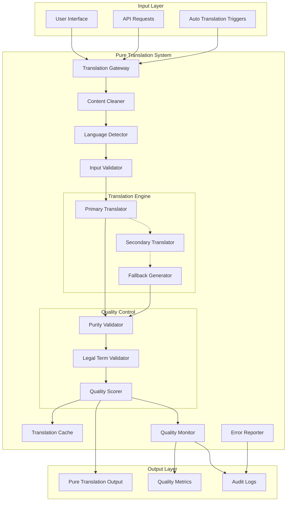

# Design Document - Pure Translation System

## Overview

The Pure Translation System is a comprehensive solution designed to eliminate language mixing in the JuristDZ legal platform's translation functionality. The system implements a multi-layered approach with zero tolerance for mixed content, ensuring 100% pure translations through advanced content analysis, aggressive cleaning, intelligent fallback mechanisms, and comprehensive quality validation.

### Design Objectives

- **Zero Tolerance Policy**: Absolute elimination of language mixing in all translation outputs
- **Proactive Prevention**: Detect and prevent issues before they reach users
- **Professional Quality**: Maintain legal terminology standards for Algerian legal practice
- **Robust Fallback**: Provide clean alternatives when automatic translation fails
- **Real-time Processing**: Ensure seamless user experience with immediate pure translations
- **Comprehensive Monitoring**: Track and improve translation quality continuously

## Architecture

### System Architecture Overview



### Multi-Layer Defense Strategy

The system implements a comprehensive defense-in-depth approach:

1. **Input Sanitization Layer**: Aggressive cleaning of problematic content before translation
2. **Translation Layer**: Multiple translation engines with quality-first approach
3. **Validation Layer**: Comprehensive purity and quality validation
4. **Fallback Layer**: Intelligent content generation when translation fails
5. **Monitoring Layer**: Continuous quality tracking and improvement

## Components and Interfaces

### Translation Gateway

**Responsibilities**:
- Central entry point for all translation requests
- Route requests to appropriate processing pipelines
- Coordinate between different system components
- Manage translation request lifecycle

**Interface**:
```typescript
interface TranslationGateway {
  translateContent(request: TranslationRequest): Promise<PureTranslationResult>
  validateTranslationQuality(text: string, targetLang: Language): Promise<QualityReport>
  reportTranslationIssue(issue: TranslationIssue): Promise<void>
  getTranslationMetrics(): Promise<TranslationMetrics>
}

interface TranslationRequest {
  text: string
  sourceLanguage: Language
  targetLanguage: Language
  contentType: ContentType
  priority: TranslationPriority
  userId?: string
  context?: TranslationContext
}

interface PureTranslationResult {
  translatedText: string
  purityScore: number
  qualityMetrics: QualityMetrics
  processingTime: number
  method: TranslationMethod
  confidence: number
}
```

### Content Cleaner

**Responsibilities**:
- Remove all problematic characters and fragments
- Eliminate UI elements and system artifacts
- Normalize text encoding and format
- Prepare content for pure translation

**Interface**:
```typescript
interface ContentCleaner {
  cleanMixedContent(text: string): Promise<CleanedContent>
  removeCorruptedCharacters(text: string): string
  eliminateUIElements(text: string): string
  normalizeEncoding(text: string): string
  detectProblematicPatterns(text: string): ProblematicPattern[]
}

interface CleanedContent {
  cleanedText: string
  removedElements: RemovedElement[]
  cleaningActions: CleaningAction[]
  originalLength: number
  cleanedLength: number
  confidence: number
}

interface ProblematicPattern {
  pattern: string
  type: PatternType
  position: number
  severity: Severity
  action: CleaningAction
}

enum PatternType {
  CYRILLIC_CHARACTERS = 'cyrillic_characters',
  UI_ELEMENTS = 'ui_elements',
  ENGLISH_FRAGMENTS = 'english_fragments',
  MIXED_SCRIPTS = 'mixed_scripts',
  CORRUPTED_ENCODING = 'corrupted_encoding',
  VERSION_NUMBERS = 'version_numbers'
}
```

### Advanced Translation Engine

**Responsibilities**:
- Execute multiple translation strategies
- Implement legal terminology preservation
- Provide intelligent fallback mechanisms
- Ensure contextual accuracy

**Interface**:
```typescript
interface AdvancedTranslationEngine {
  translateWithPrimaryMethod(content: CleanedContent, targetLang: Language): Promise<TranslationAttempt>
  translateWithSecondaryMethod(content: CleanedContent, targetLang: Language): Promise<TranslationAttempt>
  generateFallbackContent(intent: ContentIntent, targetLang: Language): Promise<FallbackContent>
  detectContentIntent(text: string): Promise<ContentIntent>
  applyLegalTerminology(text: string, targetLang: Language): Promise<string>
}

interface TranslationAttempt {
  result: string
  method: TranslationMethod
  confidence: number
  processingTime: number
  errors: TranslationError[]
  warnings: TranslationWarning[]
}

interface ContentIntent {
  category: LegalCategory
  concepts: LegalConcept[]
  context: LegalContext
  complexity: ComplexityLevel
  audience: AudienceType
}

enum LegalCategory {
  CIVIL_LAW = 'civil_law',
  CRIMINAL_LAW = 'criminal_law',
  COMMERCIAL_LAW = 'commercial_law',
  ADMINISTRATIVE_LAW = 'administrative_law',
  FAMILY_LAW = 'family_law',
  PROCEDURAL_LAW = 'procedural_law',
  CONSTITUTIONAL_LAW = 'constitutional_law'
}
```

### Purity Validation System

**Responsibilities**:
- Validate 100% language purity
- Calculate purity scores
- Detect any remaining mixed content
- Enforce zero-tolerance policies

**Interface**:
```typescript
interface PurityValidationSystem {
  validatePurity(text: string, targetLang: Language): Promise<PurityValidationResult>
  calculatePurityScore(text: string, targetLang: Language): Promise<PurityScore>
  detectMixedContent(text: string, targetLang: Language): Promise<MixedContentDetection>
  enforceZeroTolerance(text: string, targetLang: Language): Promise<boolean>
  generatePurityReport(text: string, targetLang: Language): Promise<PurityReport>
}

interface PurityValidationResult {
  isPure: boolean
  purityScore: PurityScore
  violations: PurityViolation[]
  recommendations: PurityRecommendation[]
  passesZeroTolerance: boolean
}

interface PurityScore {
  overall: number
  scriptPurity: number
  terminologyConsistency: number
  encodingIntegrity: number
  contextualCoherence: number
}

interface PurityViolation {
  type: ViolationType
  position: TextPosition
  content: string
  severity: Severity
  suggestedFix: string
}

enum ViolationType {
  MIXED_SCRIPTS = 'mixed_scripts',
  FOREIGN_FRAGMENTS = 'foreign_fragments',
  CORRUPTED_CHARACTERS = 'corrupted_characters',
  INCONSISTENT_TERMINOLOGY = 'inconsistent_terminology',
  UI_ARTIFACTS = 'ui_artifacts'
}
```

### Legal Terminology Manager

**Responsibilities**:
- Maintain French-Arabic legal term mappings
- Ensure consistent legal terminology usage
- Validate legal context preservation
- Support Algerian legal standards

**Interface**:
```typescript
interface LegalTerminologyManager {
  translateLegalTerm(term: string, sourceLang: Language, targetLang: Language): Promise<LegalTermTranslation>
  validateLegalTerminology(text: string, targetLang: Language): Promise<TerminologyValidation>
  getLegalDictionary(domain: LegalDomain): Promise<LegalDictionary>
  updateTerminology(updates: TerminologyUpdate[]): Promise<void>
  getAlgerianLegalStandards(): Promise<LegalStandards>
}

interface LegalTermTranslation {
  originalTerm: string
  translatedTerm: string
  confidence: number
  context: LegalContext
  alternatives: string[]
  usage: TermUsage
}

interface LegalDictionary {
  domain: LegalDomain
  terms: Map<string, LegalTermEntry>
  lastUpdated: Date
  version: string
  authority: LegalAuthority
}

interface LegalTermEntry {
  frenchTerm: string
  arabicTerm: string
  definition: string
  context: LegalContext
  examples: string[]
  references: LegalReference[]
}
```

## Data Models

### Translation Models

```typescript
interface Translation {
  id: string
  originalText: string
  translatedText: string
  sourceLanguage: Language
  targetLanguage: Language
  purityScore: PurityScore
  qualityMetrics: QualityMetrics
  method: TranslationMethod
  processingTime: number
  createdAt: Date
  userId?: string
  context: TranslationContext
}

interface QualityMetrics {
  purityScore: number
  terminologyAccuracy: number
  contextualRelevance: number
  readabilityScore: number
  professionalismScore: number
  userSatisfaction?: number
}

enum TranslationMethod {
  PRIMARY_AI = 'primary_ai',
  SECONDARY_AI = 'secondary_ai',
  RULE_BASED = 'rule_based',
  HYBRID = 'hybrid',
  FALLBACK_GENERATED = 'fallback_generated',
  CACHED = 'cached'
}
```

### Quality Control Models

```typescript
interface QualityReport {
  translationId: string
  overallScore: number
  purityValidation: PurityValidationResult
  terminologyValidation: TerminologyValidation
  issues: QualityIssue[]
  recommendations: QualityRecommendation[]
  timestamp: Date
}

interface QualityIssue {
  type: IssueType
  severity: Severity
  description: string
  position: TextPosition
  suggestedFix: string
  impact: QualityImpact
}

enum IssueType {
  LANGUAGE_MIXING = 'language_mixing',
  CORRUPTED_CHARACTERS = 'corrupted_characters',
  POOR_TERMINOLOGY = 'poor_terminology',
  CONTEXT_LOSS = 'context_loss',
  ENCODING_ERROR = 'encoding_error'
}

enum Severity {
  CRITICAL = 'critical',
  HIGH = 'high',
  MEDIUM = 'medium',
  LOW = 'low',
  INFO = 'info'
}
```

### Monitoring Models

```typescript
interface TranslationMetrics {
  totalTranslations: number
  pureTranslations: number
  purityRate: number
  averageQualityScore: number
  failureRate: number
  averageProcessingTime: number
  userSatisfactionScore: number
  issuesByType: Map<IssueType, number>
  methodEffectiveness: Map<TranslationMethod, MethodMetrics>
}

interface MethodMetrics {
  successRate: number
  averageQuality: number
  averageTime: number
  userPreference: number
}
```

## Correctness Properties

*A property is a characteristic or behavior that should hold true across all valid executions of a system-essentially, a formal statement about what the system should do. Properties serve as the bridge between human-readable specifications and machine-verifiable correctness guarantees.*

Now I need to use the prework tool to analyze the acceptance criteria before writing the correctness properties:

<function_calls>
<invoke name="prework">
<parameter name="featureName">pure-translation-system

After reviewing all the properties identified in the prework analysis, I need to perform a property reflection to eliminate redundancy and consolidate related properties:

**Property Reflection:**

1. **Language Purity Properties (1.1, 1.2, 1.4, 2.1, 2.2, 3.2, 3.3)** can be consolidated into comprehensive purity properties
2. **Content Cleaning Properties (2.4, 3.1, 3.4, 3.5, 8.1, 8.2)** can be combined into preprocessing properties  
3. **Validation Properties (1.3, 5.1, 5.2, 8.3)** can be unified into validation behavior properties
4. **Fallback Properties (1.5, 5.3, 6.1, 6.2, 6.3)** can be consolidated into fallback mechanism properties
5. **Monitoring Properties (5.4, 9.1, 9.2, 9.4, 9.5)** can be combined into comprehensive monitoring properties

### Property 1: Complete Language Purity
*For any* translation performed by the system, the output text must be entirely in the target language with zero fragments from any other language, achieving exactly 100% purity score
**Validates: Requirements 1.1, 1.2, 1.4, 2.1, 2.2, 3.2, 3.3**

### Property 2: Aggressive Content Preprocessing  
*For any* input text containing problematic elements (UI fragments, corrupted characters, mixed scripts), the system must clean all problematic content before attempting translation
**Validates: Requirements 2.4, 3.1, 3.4, 3.5, 8.1, 8.2**

### Property 3: Zero-Tolerance Quality Validation
*For any* translation result, the system must validate purity and reject any output that fails to meet 100% purity standards, triggering alternative methods when needed
**Validates: Requirements 1.3, 5.1, 5.2, 8.3**

### Property 4: Intelligent Fallback Generation
*For any* translation failure or quality validation failure, the system must generate contextually appropriate professional content in the target language without displaying errors to users
**Validates: Requirements 1.5, 5.3, 6.1, 6.2, 6.3, 6.4**

### Property 5: Character Encoding Integrity
*For any* text processed by the system, all character encoding must remain valid and intact throughout the translation pipeline, with corrupted characters eliminated
**Validates: Requirements 2.3, 2.5**

### Property 6: Professional Legal Terminology Consistency
*For any* legal content translation, the system must use standardized Algerian legal terminology consistently across all translations of the same concepts
**Validates: Requirements 4.1, 4.2, 4.3, 4.4, 4.5**

### Property 7: Real-time Processing Performance
*For any* user interaction requiring translation, the system must provide pure translations immediately while maintaining performance standards and handling concurrent requests
**Validates: Requirements 7.1, 7.2, 7.3, 7.4, 7.5**

### Property 8: Proactive Error Prevention
*For any* risky or problematic content detected, the system must apply enhanced cleaning and validation procedures to prevent mixed content generation
**Validates: Requirements 8.4, 8.5**

### Property 9: Comprehensive Quality Monitoring
*For any* translation operation, the system must monitor quality metrics, generate reports, track issues, and provide analytics for continuous improvement
**Validates: Requirements 5.4, 9.1, 9.2, 9.3, 9.4, 9.5**

### Property 10: User Feedback Integration
*For any* user report of translation issues, the system must provide easy reporting mechanisms, process feedback for improvement, and respond with acknowledgments and resolutions
**Validates: Requirements 10.1, 10.2, 10.3, 10.4, 10.5**

### Property 11: Fallback Logging and Recovery
*For any* fallback activation, the system must log the failure details for system improvement while ensuring users receive clean professional content
**Validates: Requirements 6.5**

### Property 12: Quality Report Generation
*For any* administrative request, the system must provide detailed quality reports containing all required metrics and analysis
**Validates: Requirements 5.5**

## Error Handling

### Error Categories and Recovery Strategies

**Translation Failure Errors**:
- **Primary Translation Failure**: Automatically retry with secondary translation method
- **Secondary Translation Failure**: Generate intelligent fallback content based on detected intent
- **Complete Translation Failure**: Provide generic professional content in target language

**Quality Validation Errors**:
- **Purity Validation Failure**: Reject result and retry with alternative translation method
- **Terminology Validation Failure**: Apply legal terminology corrections and re-validate
- **Encoding Validation Failure**: Clean encoding issues and reprocess

**System Errors**:
- **Service Unavailability**: Use cached translations or fallback generation
- **Performance Degradation**: Implement graceful degradation with simplified processing
- **Concurrent Request Overload**: Queue requests with priority-based processing

### Error Recovery Mechanisms

```typescript
interface ErrorRecoveryStrategy {
  handleTranslationFailure(error: TranslationError, request: TranslationRequest): Promise<PureTranslationResult>
  handleQualityFailure(result: TranslationAttempt, request: TranslationRequest): Promise<PureTranslationResult>
  handleSystemError(error: SystemError, request: TranslationRequest): Promise<PureTranslationResult>
  generateEmergencyFallback(request: TranslationRequest): Promise<FallbackContent>
}

enum ErrorRecoveryAction {
  RETRY_WITH_SECONDARY = 'retry_with_secondary',
  GENERATE_FALLBACK = 'generate_fallback',
  USE_CACHED_RESULT = 'use_cached_result',
  APPLY_EMERGENCY_CONTENT = 'apply_emergency_content',
  ESCALATE_TO_ADMIN = 'escalate_to_admin'
}
```

## Testing Strategy

### Dual Testing Approach

The Pure Translation System requires comprehensive testing combining unit tests and property-based tests to ensure zero tolerance for language mixing:

**Unit Tests**:
- Specific examples of problematic content (user-reported mixed content)
- Edge cases with extreme character corruption
- Integration points between translation components
- Error conditions and recovery mechanisms
- Performance benchmarks under various loads

**Property-Based Tests**:
- Universal properties that hold for all translation inputs
- Comprehensive input coverage through randomization of mixed content
- Validation of zero-tolerance policies across all scenarios
- Stress testing with concurrent translation requests

### Property-Based Testing Configuration

- **Library**: fast-check for TypeScript/JavaScript property-based testing
- **Minimum Iterations**: 100 per property test to ensure comprehensive coverage
- **Custom Generators**: Realistic mixed content, corrupted characters, UI elements
- **Test Tagging**: Each property test references its design document property
- **Tag Format**: **Feature: pure-translation-system, Property {number}: {property_text}**

### Specialized Test Generators

```typescript
// Custom generators for problematic content
const mixedContentGenerator = fc.string().map(s => 
  s + 'Pro' + 'محامي' + 'V2' + 'AUTO-TRANSLATE'
);

const corruptedCharacterGenerator = fc.string().map(s => 
  s.replace(/a/g, 'процедة').replace(/e/g, 'Defined')
);

const uiElementGenerator = fc.constantFrom(
  'AUTO-TRANSLATE', 'Pro', 'V2', 'Defined', 'JuristDZ'
);
```

### Critical Test Scenarios

1. **User-Reported Mixed Content**: Test exact problematic strings reported by users
2. **Cyrillic Character Injection**: Verify elimination of all Cyrillic characters
3. **UI Element Contamination**: Test removal of all UI elements and system artifacts
4. **Concurrent Translation Load**: Verify quality maintenance under high load
5. **Fallback Content Quality**: Ensure fallback content is professional and contextually appropriate
6. **Round-trip Translation Consistency**: Verify legal terminology consistency across multiple translations

### Performance and Quality Benchmarks

- **Translation Speed**: < 500ms for typical legal content
- **Purity Score**: Exactly 100% for all outputs
- **Concurrent Capacity**: Handle 1000+ simultaneous translation requests
- **Fallback Activation**: < 1% of all translation requests
- **User Satisfaction**: > 95% approval rating for translation quality