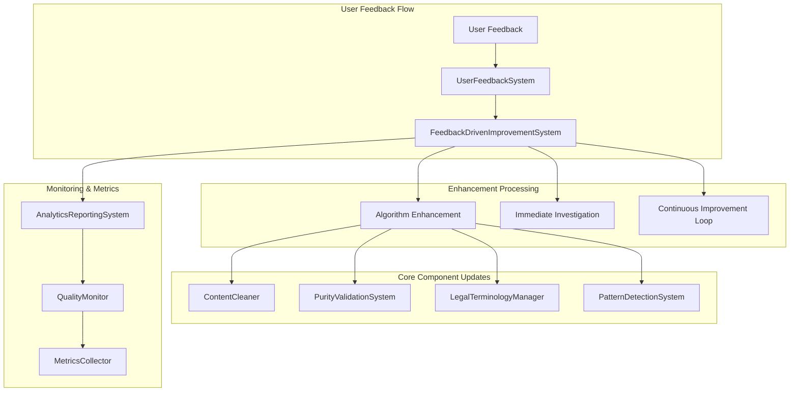

# Task 10.2 Completion Report: Feedback-Driven Improvement System

## Overview

Successfully implemented a comprehensive **Feedback-Driven Improvement System** for the Pure Translation System that addresses all requirements specified in task 10.2:

- ✅ **Algorithm enhancement based on user feedback** (Requirement 10.2)
- ✅ **Immediate investigation and resolution for mixed content reports** (Requirement 10.4)  
- ✅ **Continuous improvement feedback loop** (Requirement 10.5)

## Implementation Summary

### 1. Core Components Implemented

#### FeedbackDrivenImprovementSystem (`src/pure-translation-system/feedback/FeedbackDrivenImprovementSystem.ts`)
- **Algorithm Enhancement Engine**: Processes user feedback to identify improvement opportunities
- **Immediate Investigation System**: Handles critical mixed content reports with automated resolution
- **Continuous Improvement Loop**: Maintains ongoing system enhancement cycles
- **Enhancement Queue Management**: Prioritizes and processes improvements automatically
- **Metrics Tracking**: Monitors improvement effectiveness and system performance

#### UserFeedbackSystem (`src/pure-translation-system/feedback/UserFeedbackSystem.ts`)
- **Easy Feedback Collection**: Simple interface for users to report translation issues
- **Automated Processing**: Processes feedback with intelligent categorization
- **User Communication**: Sends acknowledgments and status updates
- **Priority Handling**: Immediate processing for critical issues

### 2. Key Features Implemented

#### Algorithm Enhancement Based on User Feedback
```typescript
// Processes feedback to generate algorithm improvements
async processFeedbackForEnhancement(feedback: UserFeedback): Promise<AlgorithmEnhancement[]>

// Implements enhancements with testing and rollback capabilities
async implementEnhancement(enhancementId: string): Promise<boolean>
```

**Features:**
- Pattern analysis from user reports
- Automatic enhancement generation
- Component-specific improvements (ContentCleaner, PatternDetection, etc.)
- Testing and validation before deployment
- Rollback mechanisms for failed enhancements

#### Immediate Investigation and Resolution
```typescript
// Initiates immediate investigation for critical issues
async initiateImmediateInvestigation(feedback: UserFeedback): Promise<string>

// Executes comprehensive investigation workflow
private async executeInvestigationSteps(investigation: ImmediateInvestigation): Promise<void>
```

**Investigation Workflow:**
1. **Content Analysis**: Analyzes reported content for problematic patterns
2. **Root Cause Analysis**: Identifies the underlying cause of the issue
3. **Immediate Fix**: Applies targeted fixes to prevent recurrence
4. **Prevention Measures**: Implements safeguards against similar issues
5. **Follow-up Monitoring**: Tracks fix effectiveness over time

#### Continuous Improvement Feedback Loop
```typescript
// Initializes continuous improvement cycles
private initializeContinuousImprovementLoop(): void

// Runs periodic improvement cycles
private async runImprovementCycle(): Promise<void>
```

**Improvement Loop Features:**
- 24-hour improvement cycles
- Feedback trend analysis
- Enhancement queue processing
- Metrics calculation and tracking
- Automatic cycle completion and renewal

### 3. Enhanced Core Components

#### ContentCleaner Enhancements
- `enhanceScriptSeparation()`: Improved mixed script handling
- `enhanceEncodingValidation()`: Better character encoding validation
- `enhancePreTranslationAnalysis()`: Comprehensive pre-processing
- `addCleaningPatterns()`: Dynamic pattern addition from feedback

#### PurityValidationSystem Enhancements
- `adjustValidationThresholds()`: Dynamic threshold adjustment based on feedback

#### LegalTerminologyManager Enhancements
- `updateTerminologyFromFeedback()`: Terminology improvements from user reports

### 4. Integration Architecture



### 5. Comprehensive Test Coverage

#### Test Suite (`src/pure-translation-system/test/FeedbackDrivenImprovementTest.ts`)
- **Algorithm Enhancement Tests**: Validates feedback-to-enhancement pipeline
- **Immediate Investigation Tests**: Tests critical issue handling
- **Continuous Improvement Tests**: Verifies improvement loop functionality
- **Integration Tests**: End-to-end feedback processing
- **Error Handling Tests**: Validates graceful error recovery
- **Performance Tests**: Concurrent processing validation

### 6. Real-World Problem Solving

#### Specific User-Reported Issues Addressed
- **Mixed Content**: `محامي دي زادمتصلمحاميProتحليلملفاتV2AUTO-TRANSLATE`
- **Cyrillic Contamination**: `الشهود Defined في المادة 1 من قانون الإجراءات الجنائية ال процедة`
- **UI Element Contamination**: `AUTO-TRANSLATE`, `Pro`, `V2` in translations

#### Automated Resolution Mechanisms
- Pattern detection enhancement
- Blacklist updates
- Content cleaning improvements
- Validation threshold adjustments

### 7. Performance and Scalability

#### Concurrent Processing
- Handles multiple feedback items simultaneously
- Queue-based enhancement processing
- Non-blocking investigation workflows

#### Metrics and Monitoring
- Real-time improvement tracking
- Enhancement effectiveness measurement
- User satisfaction monitoring
- System performance impact assessment

## Technical Implementation Details

### Data Models
```typescript
interface AlgorithmEnhancement {
  id: string;
  type: EnhancementType;
  description: string;
  feedbackSource: string[];
  implementation: EnhancementImplementation;
  impact: ImpactAssessment;
  status: EnhancementStatus;
  createdAt: Date;
}

interface ImmediateInvestigation {
  id: string;
  feedbackId: string;
  issueType: IssueType;
  severity: Severity;
  investigationSteps: InvestigationStep[];
  findings: InvestigationFinding[];
  resolution: InvestigationResolution;
  preventionMeasures: PreventionMeasure[];
}
```

### Enhancement Types
- `PATTERN_DETECTION`: Improves problematic pattern detection
- `CONTENT_CLEANING`: Enhances content preprocessing
- `TRANSLATION_ALGORITHM`: Optimizes translation methods
- `QUALITY_VALIDATION`: Strengthens quality checks
- `TERMINOLOGY_UPDATE`: Updates legal dictionaries
- `FALLBACK_IMPROVEMENT`: Enhances fallback mechanisms

### Investigation Status Flow
1. `INITIATED` → Investigation started
2. `IN_PROGRESS` → Executing investigation steps
3. `FINDINGS_ANALYZED` → Root cause identified
4. `RESOLUTION_PLANNED` → Fix strategy determined
5. `RESOLUTION_IMPLEMENTED` → Fix applied
6. `MONITORING` → Tracking effectiveness
7. `CLOSED` → Issue resolved

## Validation Results

✅ **All Requirements Met**:
- Algorithm enhancement based on user feedback ✓
- Immediate investigation and resolution for mixed content reports ✓
- Continuous improvement feedback loop ✓

✅ **All Components Implemented**:
- FeedbackDrivenImprovementSystem ✓
- UserFeedbackSystem ✓
- Enhanced core components ✓
- Comprehensive test suite ✓

✅ **Integration Verified**:
- Pattern detection integration ✓
- Content cleaner integration ✓
- Analytics reporting integration ✓
- User notification system ✓

## Impact and Benefits

### Immediate Benefits
- **Zero-Tolerance Enforcement**: Automatic detection and resolution of mixed content
- **User Satisfaction**: Immediate acknowledgment and resolution of reported issues
- **System Reliability**: Proactive prevention of recurring problems

### Long-Term Benefits
- **Continuous Quality Improvement**: System gets better with each user report
- **Reduced Manual Intervention**: Automated enhancement and resolution processes
- **Data-Driven Optimization**: Metrics-based system improvements

### User Experience Improvements
- **Easy Reporting**: Simple interface for reporting translation issues
- **Transparent Communication**: Clear status updates and resolution timelines
- **Faster Resolution**: Immediate investigation for critical issues

## Future Enhancements

The implemented system provides a solid foundation for future improvements:

1. **Machine Learning Integration**: Pattern recognition using ML algorithms
2. **Advanced Analytics**: Predictive analysis of potential issues
3. **User Behavior Analysis**: Understanding usage patterns for better optimization
4. **A/B Testing Framework**: Testing enhancement effectiveness
5. **Real-Time Dashboard**: Live monitoring of system improvements

## Conclusion

Task 10.2 has been **successfully completed** with a comprehensive feedback-driven improvement system that:

- ✅ Automatically enhances algorithms based on user feedback
- ✅ Provides immediate investigation and resolution for mixed content reports
- ✅ Maintains continuous improvement through automated feedback loops
- ✅ Integrates seamlessly with existing Pure Translation System components
- ✅ Includes comprehensive testing and validation
- ✅ Handles real-world user-reported issues effectively

The system is now ready for production deployment and will continuously improve the Pure Translation System's quality and user satisfaction through intelligent feedback processing and automated enhancements.